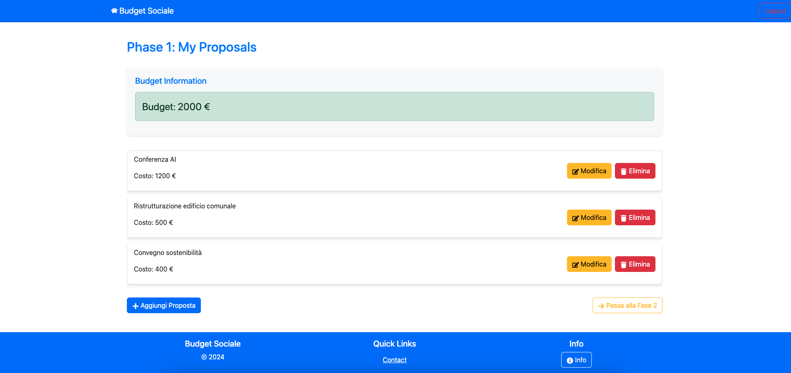
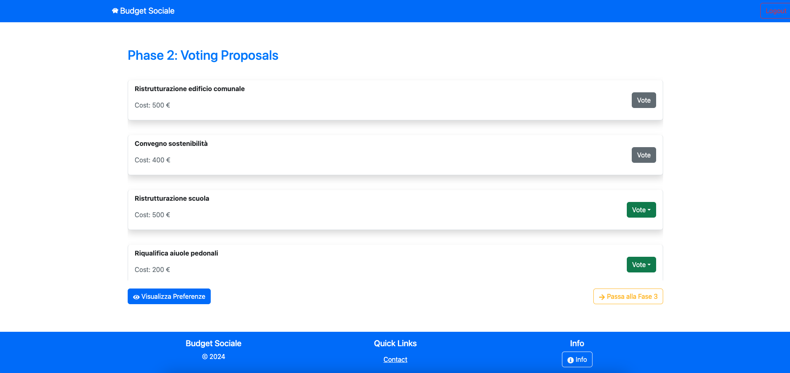

[](https://classroom.github.com/a/OLXYiqlj)
# Exam #2: "Budget Sociale"
## Student: s333237 Gabrieli Francesco

## File overview

- `index.mjs`: It defines all the APIs endpoints and behavior. It interact with database and returns to the clienti the desired data;
- `db.mjs`: It opens database;
- `proposalDAO.mjs`: It contains all the metod for interacting with the database (specifically, to interact with 'proposals' table);
- `userDAO.mjs`: It contains all the metod for interacting with the database (specifically, to interact with 'users' table);
- `budgetDAO.mjs`: It contains all the metod for interacting with the database (specifically, to interact with 'budget_phase' table);
- `proposal.mjs`: Data model for Proposal objects;
- `user.mjs`: Data model for User objects;
- `budget.mjs`: Data model for Budget objects;
- `test.http`: This file can be used for testing the API with a dedicated Visual Studio Code extension.

## React Client Application Routes

### Route `/`

- **Page Content and Purpose**
  - Redirects users based on their authentication status:
    - If logged in redirects to the current phase page (`/phaseX`).
    - If not logged in, displays a login form (`<LoginForm />`).

### Route `/phase0`

- **Page Content and Purpose**
  - Renders `<Phase0 userRole={user ? user.role : null} />`, providing functionality and UI for the admin and user phase 0.

### Route `/phase1`

- **Page Content and Purpose**
  - Renders `<Phase1 userRole={user ? user.role : null} />`, providing functionality and UI for the admin and user phase 1.

### Route `/phase2`

- **Page Content and Purpose**
  - Renders `<Phase2 userRole={user ? user.role : null} />`, providing functionality and UI for the admin and user phase 2.

### Route `/phase3`

- **Page Content and Purpose**
  - Renders `<Phase3 userRole={user ? user.role : null} />`, providing functionality and UI for the admin and user phase 3.

### Route `/user/add-proposal`

- **Page Content and Purpose**
  - Renders `<AddProposalPage userId={user ? user.id : null} />`, allowing users to add proposals.

### Route `/user/edit-proposal/:id`

- **Page Content and Purpose**
  - Renders `<EditProposalPage />`, enabling users to edit a specific proposal identified by `:id` parameter.


### Route `/user/view-voted-proposals`

- **Page Content and Purpose**
  - Renders `<ViewVotedProposalsPage />`, showing preferences and voted proposals specific to a user.

  ### Route `/utenti/anonimi`

- **Page Content and Purpose**
  - Renders `<UtentiAnonimiPages />`, providing content and functionality specific to anonymous users.

### Route `*` (Catch-All)

- **Page Content and Purpose**
  - Redirects to `/`, ensuring any undefined routes lead back to the root of the application.


## API Server

### User APIs

#### Login

HTTP method: `POST`  URL: `/api/sessions`

- Description: Performs a login for a user
- Request body: username and password of the user
- Response: `200 OK (success)`
- Reponse body: One object describing the user logged in

  ``` JSON
  {
  "id": 4,
  "name": "Ludovica",
  "surname": "Gabrieli",
  "role": "Member",
  "username": "lgabrieli"
  }
  ```

- Error responses: `401 Unauthorized (not authorized)

#### Current session

HTTP method `GET`  URL: `/api/sessions/current`

- Description: Checks whether the user is still logged in or not
- Request body: _None_
- Response: `200 OK (success)`
- Response body: One object describing the user logged in

  ``` JSON
  {
  "id": 4,
  "name": "Ludovica",
  "surname": "Gabrieli",
  "role": "Member",
  "username": "lgabrieli"
  }

- Error responses: `401 Unauthorized (not authenticated)` 

#### Delete current session

HTTP method `DELETE`  URL: `/api/sessions/current`

- Description: Destroy user's session
- Request body: _None_
- Response: `200 OK (success)`
- Response body: _None_

- Error responses: `401 Unauthorized` (not authorized)


### Proposal APIs

#### Add a new Proposal

HTTP method: `POST`  URL: `/api/proposals/add`

- Description: Insert new proposal in the database for a specified user
- Request body: description and cost of the proposal to add
- Response: `200 OK` (success)
- Response body: One object describing the added proposal:

  ``` JSON
  {
    "id": 4,
    "user_id": 4,
    "description": "Descrizione della proposta",
    "cost": 150,
    "isApproved": 0
  } 
  
  ```

- Error responses: `500 Internal Server Error` (generic error), `422 Unprocessable Entity` (invalid input), `404 Not Found` (budget not found), `403 Forbidden` (user have already 3 proposals), `403 Forbidden` (incorrect phase)

#### Update an existing proposal

HTTP method: `PUT`  URL: `/api/proposals/:id`

- Description: Update an existing proposal of a specified user
- Request body: description and cost to update
- Reponse: `200 OK` (success)
- Response body: One object describing the updated proposal:

  ``` JSON
  {
  "id": 2,
  "user_id": 4,
  "description": "Ristrutturazione edificio scuola elementare",
  "cost": 700
  }
  ```

- Error responses: `500 Internal Server Error` (generic error), `422 Unprocessable Entity` (invalid input), `404 Not Found` (proposal not found), `403 Forbidden` (user not authorized), `403 Forbidden` (incorrect phase)

#### Get all proposals of a user

HTTP method: `GET`  URL: `/api/proposals/:userId

- Description: Getting all user's proposals
- Request body: _None_
- Reponse: `200 OK` (success)
- Response body: One array of object, each describing one proposal:

  ``` JSON
  [
    {
      "id": 2,
      "user_id": 4,
      "description": "Ristrutturazione edificio",
      "cost": 900,
      "isApproved": 1
    },
    {
      "id": 3,
      "user_id": 4,
      "description": "Descrizione della proposta",
      "cost": 150,
      "isApproved": 0
    },
    {
      "id": 7,
      "user_id": 4,
      "description": "Conferenza AI",
      "cost": 1200,
      "isApproved": 0
    }
  ]
  ```

- Error responses: `500 Internal Server Error` (generic error), `404 Not Found` (proposal not found)

#### Get all proposals

HTTP method: `GET`  URL: `/api/proposals/`

- Description: Getting all proposals from database
- Request body: _None_
- Reponse: `200 OK` (success)
- Response body: One array of objects, each describing one proposal:

  ``` JSON
  [
    {
      "id": 1,
      "user_id": 2,
      "description": "Ristrutturazione scuola elementare",
      "cost": 600,
      "isApproved": 1
    },
    {
      "id": 2,
      "user_id": 4,
      "description": "Ristrutturazione edificio",
      "cost": 900,
      "isApproved": 1
    },
    {
      "id": 3,
      "user_id": 4,
      "description": "Descrizione della proposta",
      "cost": 150,
      "isApproved": 0
    },
    {
      "id": 6,
      "user_id": 3,
      "description": "Giardinaggio",
      "cost": 250,
      "isApproved": 0
    },
    {
      "id": 7,
      "user_id": 4,
      "description": "Conferenza AI",
      "cost": 1200,
      "isApproved": 0
    }
  ]
  ```
- Error responses: `500 Internal Server Error` (generic error), `404 Not Found` (proposal not found)

#### Delete a proposal

HTTP method `DELETE`  URL: `/api/proposals/:id`

- Description: Deletes a user's proposal from database
- Request body: _None_
- Response: `200 OK (success)`
- Response body: _None_

- Error responses: `500 Internal Server Error (generic error)`, `404 Not Found (proposal not found)`, `403 Forbidden (user not authorized), `403 Forbidden` (incorrect phase)`

#### Vote a proposal

HTTP method `POST`  URL: `/api/proposals/:id/vote`

- Description: Votes a proposal
- Request body: Score to assign at the proposal
- Response: `200 OK (success)`
- Response body: _None_

- Error responses: `500 Internal Server Error` (generic error), `422 Unprocessable Entity` (invalid input), `404 Not Found` (proposal not found), `400 Bad Request` (vote own proposal), `409 Conflict` (proposal already voted), `403 Forbidden` (incorrect phase)

#### Get all user's preferences

HTTP method `GET`  URL: `/api/preferences/:userId`

- Description: Gets all user's preferences from database
- Request body: _None_
- Response: `200 OK (success)`
- Response body: One array of objects, each describing one voted proposal:

  ``` JSON
  [
    {
      "id": 1,
      "user_id": 2,
      "description": "Ristrutturazione scuola elementare",
      "cost": 600,
      "isApproved": 0
    },
    {
      "id": 6,
      "user_id": 3,
      "description": "Giardinaggio",
      "cost": 250,
      "isApproved": 0
    }
  ]
  ```
- Error responses: `500 Internal Server Error (generic error)`, `404 Not Found (preference not found)`, `403 Unauthorized (user not authorized)`

#### Delete a preference

HTTP method `DELETE`  URL: `/api/preferences/:id`

- Description: Deletes a preference made by a user
- Request body: _None_
- Response: `200 OK (success)`
- Response body: _None_

- Error responses: `500 Internal Server Error` (generic error), `403 Unauthorized` (user not authorized), `403 Forbidden` (incorrect phase)

#### Approve proposal

HTTP method `POST`  URL: `/api/proposals/approved`

- Description: Approve proposals based on budget sorting descending by score
- Request body: _None_
- Response `200 OK 
- Response body: An array of object each describing a proposal approved

  ```JSON
  [
    {
      "description": "Conferenza AI",
      "username": "fgabrieli",
      "cost": 1200,
      "totScore": 6
    },
    {
      "description": "Convegno sostenibilità",
      "username": "lgabrieli",
      "cost": 800,
      "totScore": 3
    }
  ]
  ```

- Error responses: `500 Internal Server Error (generic error)`

#### Proposal not approved

HTTP method `POST`  URL: `/api/proposals/not-approved`

- Description: Shows not approved proposals sorting descending by score
- Request body: _None_
- Response `200 OK 
- Response body: An array of object each describing a proposal not approved

  ```JSON
  [
    {
      "id": 52,
      "description": "Reimpianto alberi",
      "cost": 500,
      "totScore": 1
    },
    {
      "id": 54,
      "description": "Ristrutturazione edificio comunale",
      "cost": 500,
      "totScore": 1
    }
  ]
  ```

- Error responses: `500 Internal Server Error (generic error)`

### Budget APIs

#### Insert budget

HTTP method `POST`  URL: `/api/budget`

- Description: Inserts the budget
- Request body: The amount
- Response `200 OK 
- Response body: An object describing the id and the amount of the budget

  ``` JSON
  {
  "id": 2,
  "amount": 1500
  }

- Error responses: `500 Internal Server Error` (generic error), `409 Conflict` (budget already exist), `401 Unauthorized`, (user is not an admin)

#### Get amount (budget)

HTTP method `GET`  URL: `/api/budget`

- Description: Gets the current budget's amount
- Request body: _None_
- Response: `200 OK (success)`
- Response body: the amount of the budget

  ``` JSON
  {
  "amount": 2000
  }
  ```

#### Set phase

HTTP method `PUT`  URL: `/api/budget/phase`

- Description: Insert into db 0 for phase column if there is no row for phase; Increases the phase by 1.
- Request body: _None_
- Response: `200 OK (success)`
- Response body: the phase number

  ``` JSON
  {
    "0"
  }
  ```


- Error responses: `500 Internal Server Error`

#### Get current phase

HTTP method `GET`  URL: `/api/budget/phase`

- Description: Retrieves the current phase from db.
- Request body: _None_
- Response: `200 OK (success)`
- Response body: Current phase state

  ``` JSON
  {
    "0"
  }
  ```


- Error responses: `500 Internal Server Error` (generic error)

### Reset API

#### Reset all

HTTP method `POST`  URL: `/api/reset-database`

- Description: Clear all tables from database (excluding users)
- Request body: _None_
- Response: `200 OK (success)`
- Response body: An object describing the success of the operation.

  ``` JSON
  {
  "success": true,
  "message": "Reset effettuato."
  }
  ```

  - Error responses: `500 Internal Server Error` (generic error)


## Database Tables

- Table `users` - contains all users registered in the system. Columns: id, name, surname, role, username, password, salt;
- Table `proposals` - contains all the proposals made by users. Columns: id, user_id, description, cost, isApproved.
- Table `votes` - representing the n a n relationship between users and proposals. Contains all the preferences expressed by the user. Columns: user_id, prop_id, score;
- Table `budget_phase` - contains the budget defined by the admin and the current phase. Columns: id, amount, phase.

## Main React Components

- `App` (in `App.jsx`): The main component of the React application. It handles user authentication, visualizes the interface layout, and manages informational modals. It utilizes React Router for routing based on the user's role and current phase.

- `Auth` (in `Auth.jsx`): This component allows users to log in by entering their username and password, handling form submission, and displaying error messages if authentication fails. It also includes navigation to a guest.
  
- `Phase0` (in `Phase0.jsx`): This component manages the Phase 0 page for both admins and users. If the user's role is admin, they have the ability to set the budget and proceed to Phase 1. If the user's role is not admin, they can view a banner.

- `Phase1` (in `Phase1.jsx`): This component manages the Phase 1 page for both admins and users. The admin sees a "Passa alla fase 2" button, whereas other users see a different view.

- `Phase2` (in `Phase2.jsx`): This component manages the Phase 2 page for both admins and users. The admin sees a "Passa alla fase 3" button, while other users see a different view.

- `Phase3` (in `Phase3.jsx`): This component manages the Phase 3 page for both admins and users. The admin sees a "Riavvia il processo" button, whereas other users see a different view.

- `UtentiAnonimiPages` (in `UtentiAnonimiPages.jsx`): This component determines what a non-logged-in user can view upon clicking the "Visualizza stato processo" button, based on the current phase. If the current phase is 0, 1, or 2, the non-logged-in user sees a banner. If the current phase is 3, the user can view approved proposals.

- `AddProposalPage` (in `AddProposalPage.jsx`): This component manages the form for adding a proposal in Phase 1. The form is identical for both admins and users.

- `EditProposalPage` (in `EditProposalPage.jsx`): This component manages the form for editing a proposal in Phase 1. The form is identical for both admins and users.

- `ViewVotedProposalsPage` (in `ViewVotedProposalsPage.jsx`): this component shows a table in which a user's preferences are collected. There is the possibility to remove preferences. 


## Screenshot

### Phase 1 


### Phase 2



## Users Credentials

- `Francesco Gabrieli`, username: fgabrieli, password: 1234
- `Ludovica Gabrieli`, username: lgabrieli, password: 12345
- `Luigi Bianchi`, username: lbianchi, password: 12345
- `Mario Rossi`, username: mrossi, password: 12345